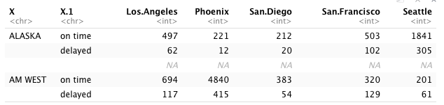

# Assignment4

#### Problem Statement:

- Compare the on-time (`Week5-Assignmenet Rubric.pdf`) and delay(`Assignment Tidying and Transformation Data.pdf`) frequency between 2 flights `Alaska` & `AM West` for 5 different cities.

#### Approach:
- I created an untidy CSV file, and imported it in R. Also, I also created a MySQL database on AWS to allow extra data importing option. Next, I cleaned the untidy data with `dplyr` package by transforming with `dplyr` functions and derived insights with corresponding visualizations.

#### Conclusion:
- While the overall on time flights performance of `AM West` was higher than `Alaska` airline, in San Francisco & Seattle, the `Alaska` airlines had `higher number of on-time flights` than AM West

---

#### Creating CSV file
- `Untidy CSV` - A CSV file was created locally and added to Google Drive for sharing
  - Link : [Google Sheet](https://drive.google.com/file/d/17-RLFldKSoFWvxLFiJRm8p2aTWWvwXbL/view?usp=sharing)


- `Tidy CSV` - A tidy version was also created importing to AWS MySQL DB
  - Link : [Google Sheet](https://drive.google.com/file/d/1_GW7PrBmnxAJva3mXouQPCfIqNmmiw55/view?usp=sharing)


- A MySQL 8.0 database was created on `AWS` with `AWS RDS` and connection was established with local computer
```
mysql -u root -h aws-movie-rating.cc7r4c0owv8u.us-east-1.rds.amazonaws.com -p 
```
  - Password entered

#### Code to create table along with databse
- Creating & using schema
  ```
  CREATE SCHEMA  IF NOT EXISTS `aws_airlines` ;
  USE  `aws_airlines` ;
  ```
- Creating table

  ```
  CREATE TABLE `aws_airlines`.`delay_status` (
  `Airline` VARCHAR(45) NOT NULL,
  `Status` VARCHAR(45) NOT NULL,
  `Los.Angeles` VARCHAR(4) NOT NULL,
  `Phoenix` VARCHAR(4) NOT NULL,
  `San.Diego` VARCHAR(4) NOT NULL,
  `San.Francisco` VARCHAR(4) NOT NULL,
  `Seattle` VARCHAR(4) NOT NULL );
  ```

- Code for populating the tables from .csv file stored locally
```
SET GLOBAL local_infile=1;
LOAD DATA LOCAL INFILE "C://User//arushi//Desktop//Assignment4//airlines.csv" INTO TABLE aws_airlines.delay_status 
FIELDS TERMINATED BY ','
LINES TERMINATED BY '\n'
IGNORE 1 LINES
(`Airline` ,`Status` ,`Los.Angeles` ,`Phoenix` ,`San.Diego` ,`San.Francisco` ,`Seattle`);
```
  - Response:
  ```
  Query OK, 4 rows affected, 3 warnings (0.30 sec)
  Records: 4  Deleted: 0  Skipped: 0  Warnings: 3
  ```
---

### Importing and Preparing Data for Untidy CSV to bring equivalent to tidy data in MySQL
---
```
raw_data <- read.csv("https://raw.githubusercontent.com/Araisedtotwo/Assignment4/master/airlines_untidy.csv", header = TRUE)

# rename columns - Ref : vignette("dplyr",package="dplyr")
raw_data = rename(raw_data, "Airline" = "X", "Status" = "X.1")

# removing extra blank row
# https://stackoverflow.com/questions/12328056/how-do-i-delete-rows-in-a-data-frame
raw_data <- raw_data[-c(3), ]

# filling columns values
raw_data[2,1] <- "ALASKA"
raw_data[4,1] <- "AM WEST"
raw_data
```


#### Importing Data from MySQL

- Read the information from your DB file into R

```
  library(RMySQL)

  mysqlconnection = dbConnect(MySQL(), user='root', password='db_password_here', dbname ='aws_movie_ratings',host='aws-movie-rating.cc7r4c0owv8u.us-east-1.rds.amazonaws.com')
    result = dbSendQuery(mysqlconnection,"SELECT `Airline`, `Status`, `Los.Angeles`, `Phoenix`, `San.Diego`, `San.Francisco`, `Seattle` FROM aws_airlines.delay_status")
    data.frame=fetch(result)
    print(data.frame)
```


#### Preparing Data

- Transformation 1

```
raw_data_2 <- pivot_longer(raw_data_2,c(Los.Angeles,Phoenix,San.Diego,San.Francisco,Seattle),names_to = "Destination", values_to = "Count")

# pivot_wider -> https://tidyr.tidyverse.org/reference/pivot_wider.html
raw_data_2 <- pivot_wider(raw_data_2,id_cols = c(Airline, Destination),names_from = Status, values_from=Count)
raw_data_2 <- rename(raw_data_2, "on_time" = "on time")

# https://stackoverflow.com/questions/2288485/how-to-convert-a-data-frame-column-to-numeric-type
raw_data_2 <- transform(raw_data_2, on_time = as.numeric(on_time), 
               delayed = as.numeric(delayed))

```

- Transformation 2
```
summary <- raw_data_2 %>% 
  group_by(Airline) %>% 
  summarize(total_delayed = sum(delayed), total_on_time = sum(on_time)) %>% 
  mutate(total_flights = total_delayed + total_on_time, percent_delayed = round(total_delayed/total_flights * 100, 2),
         percent_on_time = round(total_on_time/total_flights * 100, 2))
```


#### Reproducibility
- Data is available on the web :  [Link](https://drive.google.com/file/d/17-RLFldKSoFWvxLFiJRm8p2aTWWvwXbL/view?usp=sharing)
- RMarkdown Link: [Link](https://github.com/Araisedtotwo/Assignment4/blob/master/week5.Rmd)
- Using R Markdown text and headers : `Yes`

#### Data Analysis
- Include publication quality graphics or tables : `Provided`
- Compare the per-city on-time performance for both airlines : `Provided`
- Compare the overall on-time performance for both airlines : `Provided`
- Apparent discrepancy between the per-city and overall performances : `Provided`
- Interesting paradoxical conclusion : `Provided`

#### Submission
- Rpub Link : [Link](https://rpubs.com/Araisedtotwo/666628)
- Github Link : [Repo](https://github.com/Araisedtotwo/Assignment4)